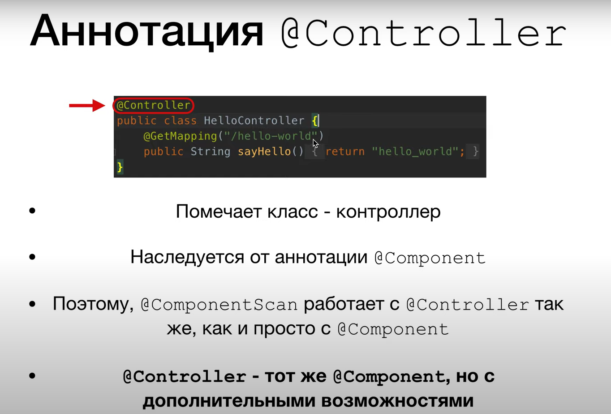

# Spring MVC
## lesson 15 - first application

- Создать приложение по архитектуре Maven и внедрить следующие зависимости:
  - `spring-core`
  - `spring-context`
  - `spring-web`
  - `spring-webmvc`
- В файле web.xml прописать для dispatcher:
```xml
<!DOCTYPE web-app PUBLIC
 "-//Sun Microsystems, Inc.//DTD Web Application 2.3//EN"
 "http://java.sun.com/dtd/web-app_2_3.dtd">

<web-app>
  <display-name>Archetype Created Web Application</display-name>

  <absolute-ordering/>

  <servlet>
    <servlet-name>dispatcher</servlet-name> //Имя сервлета
    <servlet-class>org.springframework.web.servlet.DispatcherServlet</servlet-class> // Импорт сервлета
    <init-param>
      <param-name>contextConfigLocation</param-name>
      <param-value>/WEB-INF/applicationContextMVC.xml</param-value> // Импорт конфигурации
    </init-param>
    <load-on-startup>1</load-on-startup> // Указание на то, чтобы загружался первым
  </servlet>

  <servlet-mapping>
    <servlet-name>dispatcher</servlet-name>
    <url-pattern>/</url-pattern> // Открытие по url "/"
  </servlet-mapping>
</web-app>
```
### ВАЖНО, ЧТОБЫ ВЕРСИИ БЫЛИ СОПОСТАВИМЫ
```xml
<dependency>
      <groupId>org.springframework</groupId>
      <artifactId>spring-core</artifactId>
      <version>5.2.1.RELEASE</version>
    </dependency>
```
- Первичная настойка контроллера:
```java
@Controller
public class HelloController {
  @GetMapping("/hello")
  public String sayHello() {
    return "hello_world";
  }
}
```

## lesson 16 - конфигурация приложения
- Создадим класс SpringConfig.java, в котором будет расположена конфигурация приложения, заменяющая xml
- Это делается для того, чтобы настроить вместо стандартного шаблонизатора шаблонизатор Thymeleaf
- С помощью `@Autowired` внедрена зависимость applicationContext
```java
@Configuration
@ComponentScan("ru.derendyaev.SpringMVC")
@EnableWebMvc
public class SpringConfig implements WebMvcConfigurer {

    private final ApplicationContext applicationContext;

    @Autowired
    public SpringConfig(ApplicationContext applicationContext) {
        this.applicationContext = applicationContext;
    }

    @Bean
    public SpringResourceTemplateResolver templateResolver() {
        SpringResourceTemplateResolver templateResolver = new SpringResourceTemplateResolver();
        templateResolver.setApplicationContext(applicationContext);
        templateResolver.setPrefix("/WEB-INF/views/");
        templateResolver.setSuffix(".html");
        return templateResolver;
    }

    @Bean
    public SpringTemplateEngine templateEngine() {
        SpringTemplateEngine templateEngine = new SpringTemplateEngine();
        templateEngine.setTemplateResolver(templateResolver());
        templateEngine.setEnableSpringELCompiler(true);
        return templateEngine;
    }

    @Override
    public void configureViewResolvers(ViewResolverRegistry registry) {
        ThymeleafViewResolver resolver = new ThymeleafViewResolver();
        resolver.setTemplateEngine(templateEngine());
        registry.viewResolver(resolver);
    }
}
```
- Вместо `web.xml` теперь у нас `MySpringMvcDispatcherInitializer.java`, который в методах будет указывать на необходимые внедрения
- Теперь конфигурация Сервлета находится getServletConfigClasses:
```java
    @Override
    protected Class<?>[] getServletConfigClasses() {
        return new Class[] {SpringConfig.class};
    }
```
### ВАЖНО: 
проследить, чтоб не было лишних зависимостей в `target/SpringMVC/WEB-INF/lib`

## lesson 17 - controller


- Настройка контроллеров через различные аннотации:
```java
@Controller
@RequestMapping("/first")
public class FirstController {
    @GetMapping("/hello")
    public String helloPage(){
        return "first/hello";
    }

    @GetMapping("/goodbye")
    public String gooByePage(){
        return "first/goodbye";

    }
}
```